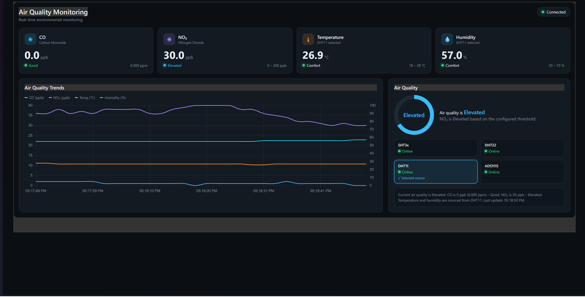

# esp32-airquality-mqtt-tls

A two-node ESP32 indoor air quality monitoring system with Alphasense CO/NO₂ electrochemical sensors, MQTT over TLS 1.3, and a real-time Node-RED dashboard.

Built for the Communication Networks lab capstone at Vietnamese–German University (VGU), ECE-ICT program.



## Architecture

```
┌─────────────────────┐       UART2 @ 115200         ┌─────────────────────┐
│   Sensor Node (A)   │  ────────────────────────▶   │  Gateway Node (B)   │
│   ESP32-WROOM-32    │   GPIO17 TX ──▶ GPIO16 RX   │  ESP32-WROOM-32    │
│                     │   Common GND                 │                     │
│  • SHT3x  (I²C)     │                              │  • WiFi STA         │
│  • DHT22  (GPIO25)  │                              │  • MQTT over TLS    │
│  • DHT11  (GPIO26)  │                              │  • Stateless bridge │
│  • ADS1115 (I²C)    │                              └────────┬────────────┘
│  • CO-B4   (ISB)    │                                       │
│  • NO₂-B43F (ISB)   │                                       │ mqtts://
│                     │                                       ▼
│  WiFi OFF (clean    │                              ┌─────────────────────┐
│   analog supply)    │                              │  Mosquitto 2.1.2    │
└─────────────────────┘                              │  TLS 1.3 on :8884   │
                                                     │  AES-256-GCM-SHA384 │
                                                     └────────┬────────────┘
                                                              │
                                                              ▼
                                                     ┌─────────────────────┐
                                                     │  Node-RED Dashboard │
                                                     │  • CO / NO₂ cards   │
                                                     │  • Trend chart      │
                                                     │  • AQ indicator     │
                                                     │  • Sensor selector  │
                                                     └─────────────────────┘
```

## Key Features

- **Split architecture** — sensor node has WiFi disabled to keep the analog supply clean; gateway handles all networking
- **ADS1115 16-bit differential ADC** — ±0.512 V full-scale, ~16 µV/LSB, far exceeding the ESP32's built-in 12-bit ADC for sub-millivolt electrochemical signals
- **MQTT over TLS 1.3** — encrypted telemetry with username/password authentication; no anonymous access
- **Threshold-based air quality indicator** — CO evaluated in ppm (Good ≤5, Elevated ≤9, Warning ≤35, Alert >35); NO₂ evaluated in ppb (Good ≤21, Elevated ≤53, Warning ≤106, Alert >106); overall status = worst of the two
- **Co-location calibration** — single-point offset calibration against an Aeroqual S500 reference instrument
- **Three T/RH sensors** — SHT3x (primary), DHT22, DHT11 for cross-sensor comparison; selectable from the dashboard at runtime

## Repository Structure

```
├── sensor-node/            ESP-IDF firmware for Board A (sensing)
│   ├── CMakeLists.txt
│   └── main/
│       ├── main.c          Sensor polling loop + calibration constants
│       ├── sensors.c/h     SHT3x + ADS1115 I²C drivers
│       ├── dht.c/h         Bit-banged DHT11/DHT22 driver
│       └── CMakeLists.txt
│
├── gateway-node/           ESP-IDF firmware for Board B (MQTT bridge)
│   ├── CMakeLists.txt
│   ├── dependencies.lock
│   └── main/
│       ├── main.c          UART2 → MQTT forwarding loop
│       ├── idf_component.yml
│       └── CMakeLists.txt
│
├── dashboard/              Node-RED flow + HTML template
│   ├── flows_dashboard_v2.json   Import-ready Node-RED flow
│   └── dashboard_v2.html         Raw HTML/CSS/JS template (reference)
│
├── certs/                  TLS certificate setup instructions
│   └── README.md
│
├── report/                 IEEE-format LaTeX lab report
│   └── report.tex
│
├── docs/                   Screenshots and demo media
│   └── dashboard_demo.png
│
└── .gitignore
```

## Prerequisites

- **ESP-IDF v6.0+** — [installation guide](https://docs.espressif.com/projects/esp-idf/en/latest/esp32/get-started/)
- **Node-RED** with `node-red-dashboard` 3.6.6 — `npm install -g node-red` then `cd ~/.node-red && npm install node-red-dashboard`
- **Mosquitto 2.x** — [download](https://mosquitto.org/download/)
- **Chart.js 4.4.1** — served locally via Node-RED's `httpStatic` (see Dashboard Setup below)

## Quick Start

### 1. Generate TLS certificates

See [`certs/README.md`](certs/README.md) for step-by-step instructions.

### 2. Configure and start Mosquitto

```bash
mosquitto -c /path/to/mosquitto.conf -v
```

### 3. Build and flash the sensor node

```bash
cd sensor-node
idf.py set-target esp32
idf.py build
idf.py -p COMx flash monitor
```

### 4. Build and flash the gateway node

Edit `main/main.c` — set `WIFI_SSID`, `WIFI_PASS`, `MQTT_URI`, `MQTT_USER`, `MQTT_PASS` to your values.

```bash
cd gateway-node
idf.py set-target esp32
idf.py add-dependency "espressif/mqtt"
idf.py build
idf.py -p COMy flash monitor
```

> **Note:** ESP-IDF v6.0 moved the MQTT component out of core. The `idf.py add-dependency` step is required on first build.

### 5. Set up the Node-RED dashboard

```bash
# Download Chart.js for local serving (no internet needed at runtime)
mkdir -p ~/.node-red/static
curl -o ~/.node-red/static/chart.js https://cdn.jsdelivr.net/npm/chart.js@4.4.1/dist/chart.umd.min.js
```

Add to `~/.node-red/settings.js`:
```js
httpStatic: require('path').join(require('os').homedir(), '.node-red', 'static'),
```

Start Node-RED, import `dashboard/flows_dashboard_v2.json`, deploy, and open `http://localhost:1880/ui`.

### 6. Test without hardware

You can run the entire dashboard pipeline on a laptop with fake data:

```bash
# Terminal 1: start Mosquitto
mosquitto -c mosquitto.conf -v

# Terminal 2: start Node-RED
node-red

# Terminal 3: push fake data (topic must match your Node-RED MQTT-in node)
mosquitto_pub -h localhost -p 8884 --cafile certs/ca.crt \
  -u esp_gateway -P your_password \
  -t "your/topic/here" \
  -m '{"co_ppb":1.2,"no2_ppb":38,"sht_temp_c":26.3,"sht_rh_pct":61,"dht22_temp_c":26.5,"dht22_rh_pct":62,"dht11_temp_c":27.2,"dht11_rh_pct":55,"co_mv":120.5,"no2_mv":-7.2}'
> The MQTT topic is user-defined. It must be the same in three places:
> 1. **Gateway firmware** — `MQTT_TOPIC` in `gateway-node/main/main.c`
> 2. **Node-RED flow** — the `mqtt in` node's topic field (edit in the Node-RED editor)
> 3. **Test commands** — the `-t` argument to `mosquitto_pub` / `mosquitto_sub`
>
> The default used in this project is `vgu/airquality/node1`.
```

## Calibration

The sensors were calibrated by co-location against an Aeroqual S500 reference instrument (VGU asset) over a 30-minute window:

| Parameter | Method | Result |
|-----------|--------|--------|
| CO zero | Clean lab air (0 ppm) | `CAL_CO_ZERO = 122.85 mV` |
| NO₂ anchor | S500 reference at 40 ppb | `CAL_NO2_ZERO = 2.54 mV` → output matches 40 ppb |
| CO sensitivity | Datasheet nominal (no controlled exposure) | `0.350 mV/ppb` |
| NO₂ sensitivity | Datasheet nominal (no controlled exposure) | `−0.250 mV/ppb` |

**Limitations:** This is a single-point offset calibration. The sensitivity slopes are manufacturer nominal values, not empirically determined. A full two-point span calibration would require controlled gas exposure and is identified as future work.

## Dashboard Threshold Ranges

| Gas | Unit | Range | Status |
|-----|------|-------|--------|
| CO | ppm | 0–5 | Good |
| CO | ppm | >5–9 | Elevated |
| CO | ppm | >9–35 | Warning |
| CO | ppm | >35 | Alert |
| NO₂ | ppb | 0–21 | Good |
| NO₂ | ppb | >21–53 | Elevated |
| NO₂ | ppb | >53–106 | Warning |
| NO₂ | ppb | >106 | Alert |

The overall air quality indicator takes the **worse** of CO and NO₂ status. CO is converted from ppb to ppm (`co_ppm = co_ppb / 1000`) before threshold comparison.

## Security Validation

The [`security/`](security/) folder contains an automated benchmark script that tests the Mosquitto broker configuration against 11 attack scenarios (corresponding to Table II in the lab report):

```bash
pip install paho-mqtt

python security/mqtt_tls_benchmark.py \
  --host 127.0.0.1 --port 8884 \
  --cafile certs/ca.crt \
  --user esp_gateway --password your_password \
  --topic "your/topic/here"
```

Tests include: plaintext rejection, TLS handshake verification, hostname mismatch, missing/wrong credentials, ACL cross-user isolation, and replay detection. See [`security/README.md`](security/README.md) for full details and expected results.

## Hardware

- 2× ESP32-WROOM-32 dev boards (38-pin sensor, 30-pin gateway)
- Sensirion SHT3x temperature/humidity sensor
- DHT22 + DHT11 (comparison T/RH sensors)
- Texas Instruments ADS1115 16-bit ADC (I²C, ±0.512V PGA)
- Alphasense CO-B4 on ISB rev 5
- Alphasense NO₂-B43F on ISB rev 5

## License

This project was developed as a lab capstone for academic purposes. See the [report](report/report.pdf) for full technical documentation.
